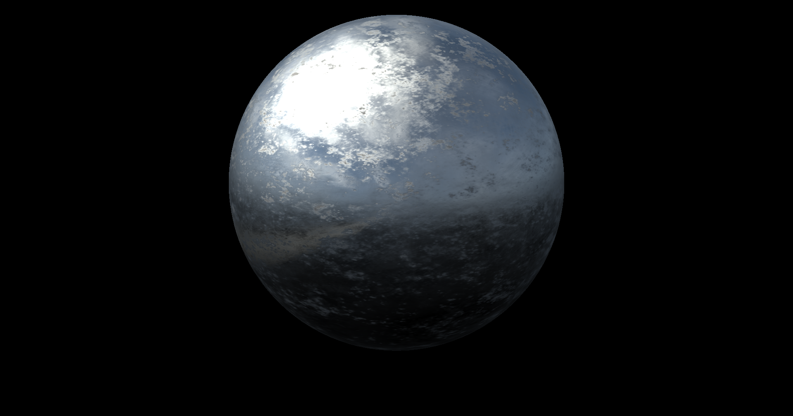
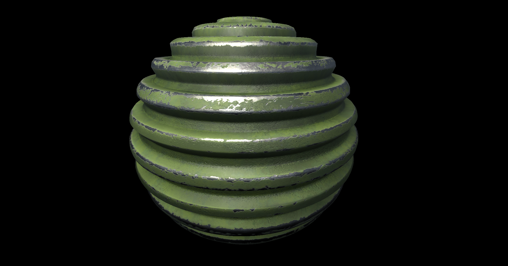
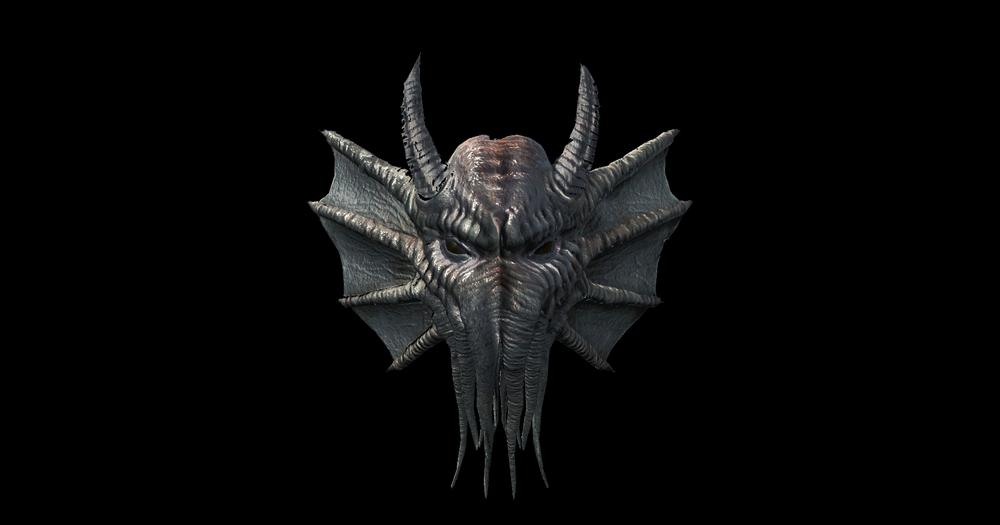
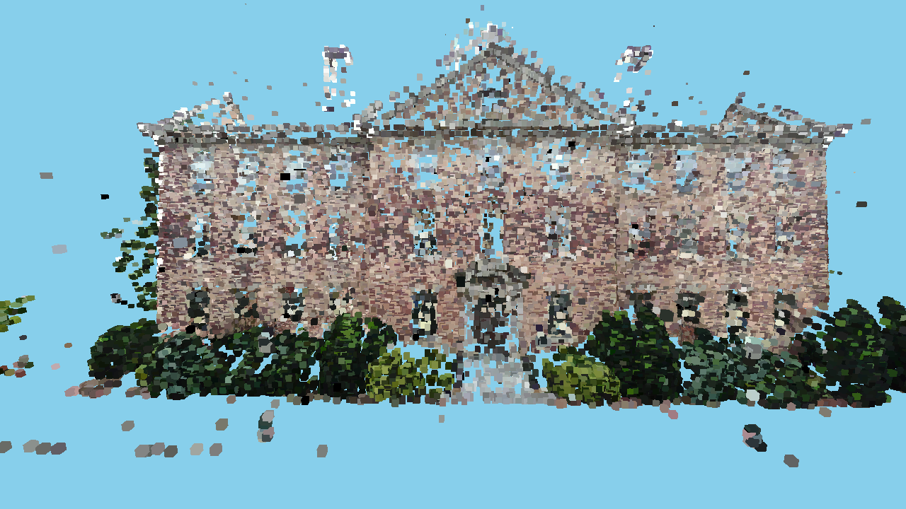
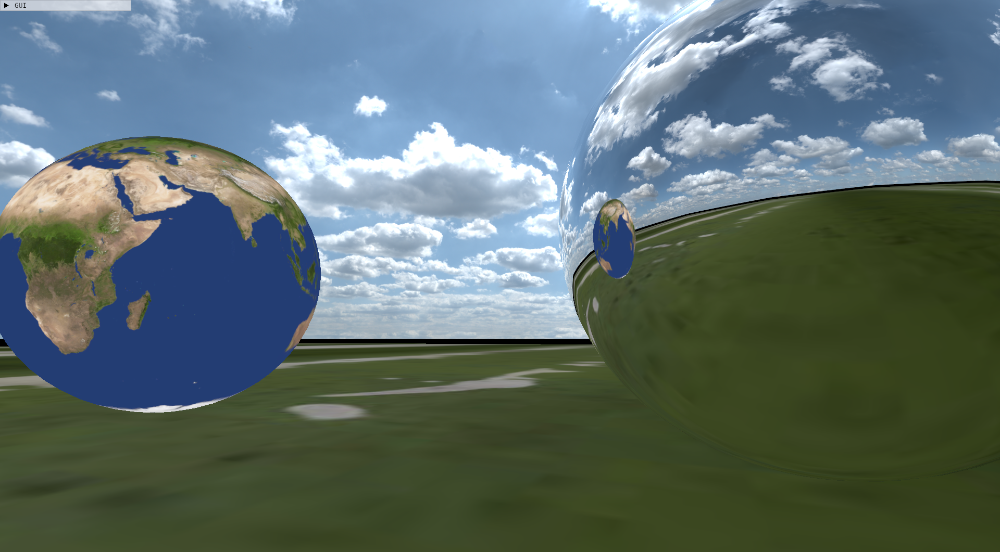
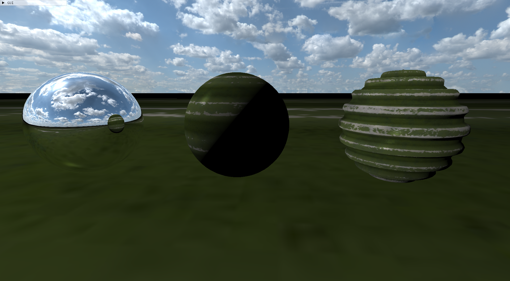
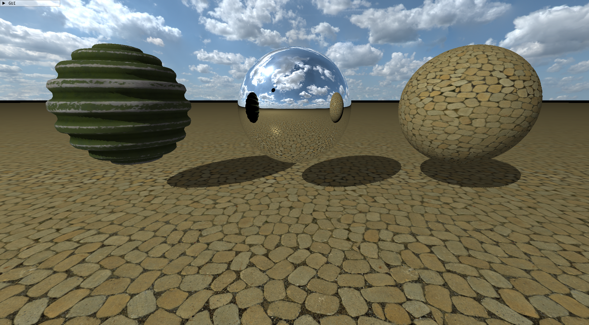

# 3D Graphics Engine Project

DirectX 12을 사용한 로우레벨 3D 렌더링 엔진.  
렌더링 파이프라인 구성, 셰이더 처리, 모델 로딩 등을 직접 구현함.

## 주요 기능

### 1. Physically Based Rendering (PBR)
   

### 2. Point cloud rendering
 

### 3. Cubemap reflection
 

### 4. Texture & shadow mapping
 


## 💻 Windows
### Installing Dependencies
```
vcpkg install directxtex[core,dx11,openexr]:x64-windows
vcpkg install directxtk12[core,xaudio2-9]:x64-windows
vcpkg install directxtk[core,xaudio2-9]:x64-windows
vcpkg install directx-headers:x64-windows
vcpkg install fp16:x64-windows glm:x64-windows
vcpkg install imgui[core,dx11-binding,dx12-binding,win32-binding]:x64-windows
vcpkg install assimp:x64-windows
vcpkg install boost-serialization:x64-windows
vcpkg install physx:x64-windows
vcpkg install physx:x64-windows
```
### Libtorch 설치 후 PATH 설정
본 프로젝트는 **빌드 구성** 에 따라 서로 다른 Libtorch 폴더를 사용합니다.

#### Libtorch 다운로드
- 공식 설치/다운로드 안내: https://pytorch.org/get-started/locally/

#### PATH 설정
- **Debug**: `Libtorch_DEBUG`
- **Release**: `Libtorch`

실행 시 필요한 DLL을 찾기 위해 환경변수 PATH에 각 구성의 `libtorch` 폴더를 추가해야 합니다.

- **Debug 실행 시**: `...\thirdparty\libtorch-win-shared-with-deps-debug-2.9.0+cu130\libtorch`
- **Release 실행 시**: `...\thirdparty\libtorch-win-shared-with-deps-2.9.0+cu130\libtorch`


